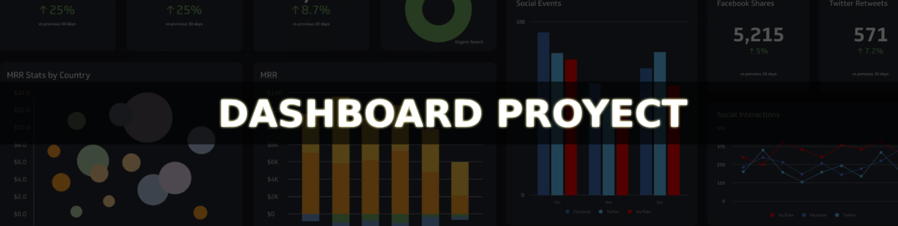

Durante el desarrollo de OFA, mi proyecto anterior, pude utilizar Chart.js pero sin poder explotar demaciado sus cualidades, dado que el contexto y las entidades que utilizaba no favorecían la confección de los dashboard que me hubiese gustado exponer en la aplicación web. Teniendo esto en cuenta y una vez terminado OFA, me aboqué en el desarrollo de un pequeño proyecto que me permitiese, ahora sí, utilizar las características que esta biblioteca me ofrecía, por lo que finalmente inicié el desarrollo de **dashboard.proyect**. 

 

# :link: Tecnologias

Para este proyecto, genere una **aplicación web de ASP.NET Core** con **.NET 8** y con un patrón de arquitectura **MVC**.

- **Chart.js (3.9.1):** Graficación de los datos

- **Chartjs plugin streaming:** Extension de chart.js; se encarga del manejo del gráfico en tiempo real

- **SignalR:** Manejo de datos entre cliente-servidor en tiempo real

> [!IMPORTANT]
> Se utiliza la versión 3.9.1 de chart.js debido a que necesitaba compatibilidad con su plugin. 

 

# :link: Datos para pruebas

Para generar los dashboards, primero que nada iba a necesitar datos que sean entre sí consistentes y tuviesen una estructura o serie de características que favorecieran la confección de varios gráficos utilizando sus propiedades.

Por otra parte, también necesitaba una forma de generar un listado de estos datos y que sean medianamente consistentes para hacer el proyecto un poco más realista. Para cumplir con esta finalidad elabore un pequeño algoritmo que genera la cantidad de datos de prueba que necesite, el cual está precisamente aquí, junto a la codificación de la entidad.

 

# :link: Funciones

### Ventas
En esta página opte por utilizar distintos tipos de gráficos y fórmulas para exponer datos útiles a la temática en la que se basa el proyecto. Si bien son gráficos típicos, fueron útiles para ir aprendiendo sobre el manejo de las distintas configuraciones que se le pueden dar en cada caso.

### Ventas dinamico
La idea de esta página fue codificar un algoritmo que me permitiese generar un gráfico por cada categoría de manera dinámica. Es decir, que sin hacer modificaciones este pudiese igualmente generar un gráfico por cada categoría que se agregue, o reciprocamente no generar un gráfico si ya no hay ventas de una determinada categoría.

### Ventas RT
Esta función tenía la finalidad de utilizar en la codificación de una misma solución SignalR y Chart.js. Efectivamente, pude hacerlo y agregué también un método que permite la inserción de data al gráfico que puede ver, en tiempo real, cada usuario conectado al hub. Esta es una función en la que me gustaría seguir trabajando en un futuro, ya que tengo pendiente lo que sería remover data del gráfico.

### Ventas Server
Entre los dashboard que quería codificar, también tenía previsto configurar uno que avanze en tiempo real, presentando los valores segundo a segundo, pero al momento de revisar la documentación de Chart.js note que había un vacío en este tipo de gráfico precisamente, e investigando, terminé dando con **chartjs plugin streaming**, justamente una extensión que permite trabajar con este tipo de gráficos.
Intentando mantener la temática, pero al mismo tiempo buscando un contexto en el que sea útil este tipo de gráficos por segundo, opte por codificar una función que permita el "Monitoreo de CPU" del servidor, claramente con datos de prueba.

